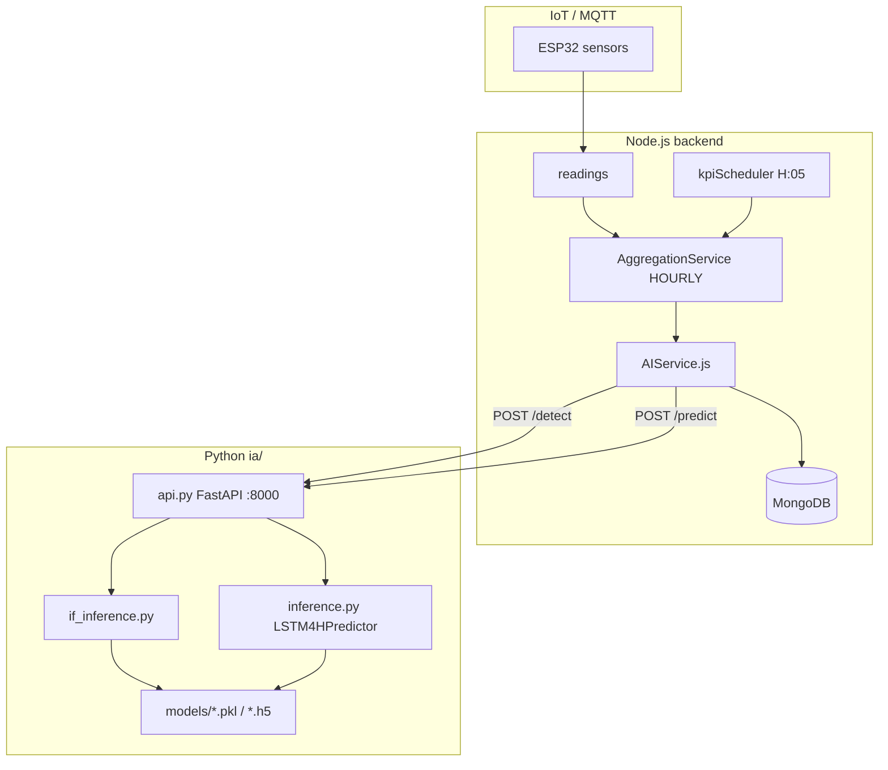
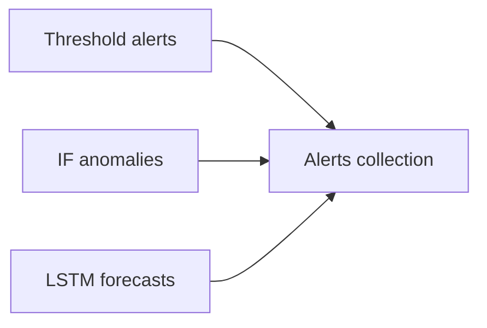

# Pollution Monitoring — IA Module Documentation

**Version:** 1.0  
**Last updated:** May 2026  
**Scope:** The `ia/` directory and its integration with the Node.js backend.

---

## Table of contents

1. [Executive summary](#1-executive-summary)
2. [Architecture](#2-architecture)
3. [Directory structure](#3-directory-structure)
4. [Machine learning models](#4-machine-learning-models)
5. [Configuration (`config.py`)](#5-configuration-configpy)
6. [Data pipeline and notebooks](#6-data-pipeline-and-notebooks)
7. [Python modules](#7-python-modules)
8. [FastAPI microservice](#8-fastapi-microservice)
9. [Backend integration (Node.js)](#9-backend-integration-nodejs)
10. [Model artifacts and metrics](#10-model-artifacts-and-metrics)
11. [Operations guide](#11-operations-guide)
12. [Testing and scripts](#12-testing-and-scripts)
13. [Roadmap and related documents](#13-roadmap-and-related-documents)

---

## 1. Executive summary

The **IA module** adds two complementary ML capabilities to the pollution monitoring platform:

| Layer | Model | Role |
|-------|--------|------|
| **Regulatory thresholds** | Rule-based (MongoDB) | ANPE / Décret 2018-928 compliance alerts |
| **Anomaly detection** | Isolation Forest (IF) | Multivariate “unusual profile” on hourly site aggregates |
| **Forecasting** | LSTM 4 h | Predict pollutant levels +1…+4 hours ahead for shift planning |

**Production MVP (current):**

- **One LSTM model:** `model_lstm_4h.h5` — 48 h lookback, 1 h timestep, 8 output features, horizon +1…+4 h.
- **Hybrid inference:** Per pollutant, predictions use LSTM, persistence baseline, or blend depending on training skill and `LSTM_ACCEPTANCE` fallback list.
- **Isolation Forest:** 6-feature vector (NOX, SOX, PM25, PM10, CO2, COV) on the latest complete hourly bucket.
- **Scheduler:** After each HOURLY KPI aggregation (`H:05`), the backend runs **IF first, then LSTM** for all sites.

Regulatory limits are **never** stored in Python config — they are read from MongoDB (`polluants` collection) so admin threshold changes stay in sync.

---

## 2. Architecture



### Data flow (hourly cycle)

1. Raw readings arrive via MQTT (10–30 s cadence).
2. At **H:05**, `kpiScheduler` aggregates the previous hour per site/zone/pollutant → `AggregateData` (HOURLY).
3. **Isolation Forest:** `AIService` builds a 6-value vector from the last hour → `POST /detect` → persists `AnomalyDetection`, optional `Alert` (type `Anomaly`).
4. **LSTM 4 h:** `AIService` builds a **48×8** matrix from zone-level HOURLY series → `POST /predict` → persists `LstmForecast`, optional forecast alerts if enabled.

### Design principles

- **Python owns ML inference** (TensorFlow, scikit-learn); **Node.js owns persistence, RBAC, and alerting**.
- **No shuffle** on time-series splits; train/val/test are temporal (70/15/15).
- **Pre-training** uses public datasets (EPA AQS, Beijing, UCI); **production inference** uses MongoDB hourly aggregates.
- **Go/no-go deployment** is driven by `lstm_4h_skill_report.json` → `acceptance.go_deploy` and `recommendation`.

---

## 3. Directory structure

```
ia/
├── DOCUMENTATION.md          # This file
├── config.py                 # Central configuration (paths, pollutants, LSTM, IF, API)
├── api.py                    # FastAPI microservice (health, predict, detect)
├── inference.py              # LSTM4HPredictor — hybrid LSTM + persistence
├── if_inference.py           # IFAnomalyDetector
├── lstm_training.py          # Training helpers (windows, skill, build_model, etc.)
├── data_generator.py         # Synthetic sensor data for local experiments
├── regulatory_standards.py   # (placeholder / future ANPE helpers)
├── requirements.txt          # Python dependencies
│
├── data/                     # Datasets (training — large files may be gitignored)
│   ├── raw_merged.csv
│   ├── cleaned_features.csv
│   ├── training_dataset.csv
│   ├── lstm_train_val_test.pkl
│   ├── lstm_metadata.json
│   ├── epa_raw/              # EPA AQS hourly zips
│   └── uci_raw/
│
├── models/                   # Exported production artifacts
│   ├── model_isolation_forest.pkl
│   ├── if_scaler.pkl
│   ├── if_metrics.json
│   ├── model_lstm_4h.h5
│   ├── lstm_scalers.pkl
│   ├── lstm_4h_metrics.json
│   ├── lstm_4h_skill_report.json
│   └── … (plots, history JSON)
│
├── notebooks/                # Jupyter training pipeline (01 → 07)
├── docs/                     # Focused guides (integration, training plan, LSTM strategy)
└── scripts/                  # Utilities and smoke tests
```

**Backend touchpoints** (outside `ia/` but required for production):

| Path | Role |
|------|------|
| `backend/services/AIService.js` | Orchestration, matrix building, HTTP calls, MongoDB persist |
| `backend/config/ia.js` | Feature order, pollutant mapping, env flags |
| `backend/routes/iaRoutes.js` | REST API under `/api/ia/*` |
| `backend/models/LstmForecast.js` | Forecast document schema |
| `backend/models/AnomalyDetection.js` | IF result schema |
| `backend/schedulers/kpiScheduler.js` | Triggers IF + LSTM after HOURLY |
| `backend/env.ia.example` | Environment variable template |

---

## 4. Machine learning models

### 4.1 Isolation Forest (anomaly detection)

**Purpose:** Flag hourly site profiles that are rare in multivariate space (e.g. high NOX + low CO2 combination), without labeled anomalies.

| Parameter | Value |
|-----------|--------|
| Algorithm | `sklearn.ensemble.IsolationForest` |
| Features | 6: `NOX`, `SOX`, `PM25`, `PM10`, `CO2`, `COV` |
| `contamination` | 0.05 |
| `n_estimators` | 100 |
| Score threshold | -0.1 (`decision_function` < threshold → anomaly) |

**Training data:** `training_dataset.csv` (hourly, multi-site), notebook `04_isolation_forest_training.ipynb`.

**Typical test metrics** (`if_metrics.json`):

| Metric | Value (reference run) |
|--------|------------------------|
| Precision (injected test) | ~0.72 |
| Recall (injected test) | 1.0 |
| F1 (injected test) | ~0.84 |
| AUC-ROC (injected test) | ~1.0 |

**Production input:** One row = last complete hourly bucket averaged at site level (minimum 4 of 6 pollutants filled).

### 4.2 LSTM 4 h (forecasting)

**Purpose:** Anticipate pollutant levels 1–4 hours ahead for operational planning and optional forecast-based alerts.

| Parameter | Value |
|-----------|--------|
| Lookback | 48 steps × 1 h = **48 hours** |
| Horizon | 4 steps = **+1 h … +4 h** |
| Input features | 8: `CO2`, `NOX`, `SOX`, `PM25`, `PM10`, `COV`, `TEMPERATURE`, `HUMIDITY` |
| Architecture | 2× LSTM (64, 32 units, `relu`) + Dense 16, dropout 0.2 |
| Loss | Huber (weighted per pollutant) |
| Normalization | `MinMaxScaler` + winsorization (1st–99th percentile) in `lstm_scalers.pkl` |

**Hybrid inference logic** (`inference.py`):

| `prediction_source` | When |
|-------------------|------|
| `LSTM` | Pollutant not in fallback list and validation skill > 0 |
| `PERSISTENCE` | Pollutant in `allow_fallback_pollutants` or skill ≤ 0 |
| `blend` | Partial alpha from `blend_alpha_by_pollutant` (future Sprint 3) |

**Fallback pollutants** (persistence preferred): `NOX`, `SOX`, `PM25`, `COV`, `HUMIDITY`  

**LSTM-priority pollutants** (skill thresholds apply): `CO2`, `PM10`, `TEMPERATURE`

**Current deployment recommendation** (`lstm_4h_skill_report.json` → `acceptance`):

```json
{
  "go_deploy": true,
  "recommendation": "deploy_with_hybrid_fallback",
  "failed_checks": ["global_skill", "horizon_mae_ratio_+1h"]
}
```

| `recommendation` | Backend behavior |
|------------------|------------------|
| `deploy` | LSTM for all pollutants |
| `deploy_with_hybrid_fallback` | LSTM where skill OK; persistence for fallback list |
| `retrain_before_deploy` | Do not run forecasts (`go_deploy=false`) |

> **Note:** A 2 h LSTM was evaluated but **not deployed** in MVP — only `horizon_hours=4` is supported by `api.py` and `AIService`.

### 4.3 Three-layer alert strategy



- **Threshold:** Real-time / aggregated values vs `regulatoryLimit` / `warningThreshold` in MongoDB.
- **IF:** `Alert` type `Anomaly`, source `ISOLATION_FOREST` (if `IA_CREATE_ANOMALY_ALERTS=true`).
- **LSTM:** Optional forecast exceedance alerts (if `IA_CREATE_FORECAST_ALERTS=true`, default **false**).

---

## 5. Configuration (`config.py`)

Single source of truth for Python. Key sections:

### Paths

- `BASE_DIR` — `ia/` root  
- `MODELS_DIR` — `ia/models/` (auto-created)

### Pollutants

- `POLLUTANT_CONFIG` — physical bounds, units, sensor models (DB names: `CO2`, `NOX`, `SO2`, `PM1`, `PM25`, `COV`, `TEMPERATURE`, `HUMIDITY`)
- `LSTM_FEATURE_NAMES` — tensor column order (note **SOX** not SO2, **PM10** not PM1)
- `IF_FEATURE_NAMES` — `["NOX", "SOX", "PM25", "PM10", "CO2", "COV"]`

### LSTM

- `LSTM_CONFIG` — lookback, horizon, architecture, training hyperparameters, winsorization
- `LSTM_ACCEPTANCE` — go/no-go thresholds and fallback list
- `LSTM_INTEGRATION` — per-horizon paths, alert source, blend alphas

### Isolation Forest

- `ISOLATION_FOREST` — sklearn params + artifact paths
- `IF_INTEGRATION` — alert source, minimum features

### API

- `API_HOST` / `API_PORT` — default `0.0.0.0:8000`
- Env: `IA_HOST`, `IA_PORT`, `MONGO_URI`, `MONGO_DB` (for scripts that touch DB)

### Environment variables (backend)

See `backend/env.ia.example`:

| Variable | Default | Description |
|----------|---------|-------------|
| `IA_ENABLED` | `true` | Master switch for IA scheduler |
| `IA_IF_ENABLED` | `true` | Isolation Forest in scheduler |
| `IA_SERVICE_URL` | `http://127.0.0.1:8000` | FastAPI base URL |
| `IA_LOOKBACK_HOURS` | `48` | LSTM window length |
| `IA_REQUEST_TIMEOUT_MS` | `30000` | HTTP timeout to Python |
| `IA_CREATE_ANOMALY_ALERTS` | `true` | Create MongoDB alerts on IF hit |
| `IA_CREATE_FORECAST_ALERTS` | `false` | Create alerts from LSTM exceedance |
| `IA_IF_MIN_FEATURES` | `4` | Minimum pollutants for `/detect` |
| `IA_SKILL_REPORT_PATH` | `ia/models/lstm_4h_skill_report.json` | Optional override |

Node mirror: `backend/config/ia.js` (`LSTM_FEATURE_ORDER`, `DB_POLLUTANT_TO_LSTM`, `IF_FEATURE_ORDER`).

---

## 6. Data pipeline and notebooks

End-to-end training flow. Run notebooks **in order** when (re)building models.

| # | Notebook | Output | Purpose |
|---|----------|--------|---------|
| 01 | `01_dataset_preparation.ipynb` | `data/raw_merged.csv` | Merge EPA, Beijing, UCI; resample to 1 h |
| 02 | `02_data_cleaning_preprocessing_FIXED.ipynb` | `data/cleaned_features.csv` | Impute, EMA, feature engineering |
| 03 | `03_synthetic_data_generation.ipynb` | `data/training_dataset.csv` | EPA PM10/VOC + synthetic fill for gaps |
| 04 | `04_isolation_forest_training.ipynb` | `models/model_isolation_forest.pkl`, `if_metrics.json` | Train & evaluate IF |
| 05 | `05_lstm_training_preparation.ipynb` | `lstm_train_val_test.pkl`, `lstm_scalers.pkl` | Sliding windows 48→4 |
| 06 | `06_lstm_training_4h_horizon.ipynb` | `model_lstm_4h.h5`, skill reports | Train LSTM MVP |
| 07 | `07_lstm_training_24h_horizon.ipynb` | (deferred) | Tactical 15 min / longer horizon — **not MVP** |

**Canonical timestep for MVP:** 1 hour (`LSTM_CONFIG["timestep_minutes"]: 60`).

**Data sources:**

- **EPA AQS** hourly zips in `data/epa_raw/`
- **UCI Air Quality** — `data/uci_raw/AirQualityUCI.zip`
- **Synthetic** rows marked `synthetic=true` where public data lacks PM10/CO2/COV

Detailed phase descriptions: [`docs/TRAINING_PLAN.md`](docs/TRAINING_PLAN.md).

---

## 7. Python modules

### `config.py`

Central constants — all other modules import from here. See [§5](#5-configuration-configpy).

### `lstm_training.py`

Shared training/inference utilities:

- `build_windows()` — sliding (lookback, horizon) tensors  
- `temporal_split()` — 70/15/15 without shuffle  
- `calendar_matrix_from_timestamps()` — sin/cos hour and day-of-week  
- `persistence_baseline()` — last-value baseline for skill comparison  
- `build_lstm_model()`, `train_lstm_4h()`, skill metrics and acceptance checks  
- `load_lstm_model_for_inference()` — Keras load for `inference.py`

Used by notebooks **05** and **06** and importable for scripted retraining.

### `inference.py` — `LSTM4HPredictor`

```python
from inference import LSTM4HPredictor
import numpy as np

pred = LSTM4HPredictor(horizon_hours=4)
# matrix: (48, 8) raw physical values, columns = LSTM_FEATURE_NAMES
out = pred.predict(matrix_48h, timestamps_utc=None)
# out["forecasts"][0]["pollutants"]["CO2"]["prediction_source"]  → "LSTM" | "PERSISTENCE" | "blend"
```

Loads: `model_lstm_4h.h5`, `lstm_scalers.pkl`, `lstm_4h_skill_report.json`.

### `if_inference.py` — `IFAnomalyDetector`

```python
from if_inference import IFAnomalyDetector

det = IFAnomalyDetector()
result = det.detect([nox, sox, pm25, pm10, co2, cov])  # order: IF_FEATURE_NAMES
# result["is_anomaly"], result["anomaly_score"], result["severity"]
```

### `api.py`

FastAPI app version **1.1.0**:

- Startup: loads `LSTM4HPredictor` and `IFAnomalyDetector` (IF optional if artifacts missing)
- `GET /health` — LSTM `go_deploy`, IF loaded, feature columns
- `POST /predict` — body: `lookback_values` (48×8), optional `timestamps_utc`
- `POST /detect` — body: `feature_values` (6), optional `feature_cols`

### `data_generator.py`

Generates realistic multi-pollutant synthetic time series (30 days, anomalies, correlations) for local ML experiments — **not** used in production scheduler.

### `regulatory_standards.py`

Reserved for shared ANPE limit helpers; regulatory values in production come from **MongoDB** via the backend.

---

## 8. FastAPI microservice

### Start

```bash
cd ia
pip install -r requirements.txt
python api.py
# Listens on http://0.0.0.0:8000 (IA_HOST / IA_PORT)
```

### `GET /health`

Example response:

```json
{
  "status": "ok",
  "lstm": {
    "loaded": true,
    "go_deploy": true,
    "horizon_hours": 4,
    "lookback_hours": 48,
    "use_calendar_features": false,
    "alert_source": "LSTM_4H"
  },
  "isolation_forest": {
    "loaded": true,
    "feature_cols": ["NOX", "SOX", "PM25", "PM10", "CO2", "COV"],
    "score_threshold": -0.1,
    "alert_source": "ISOLATION_FOREST"
  }
}
```

### `POST /predict`

**Request:**

```json
{
  "horizon_hours": 4,
  "lookback_values": [[600, 0.05, ...], ...],
  "timestamps_utc": ["2026-05-21T10:00:00.000Z", "..."]
}
```

- `lookback_values`: exactly **48 rows × 8 columns**, order `LSTM_FEATURE_NAMES`
- `timestamps_utc`: required only if `use_calendar_features=true` in config

**Response (abbreviated):**

```json
{
  "horizon_hours": 4,
  "alert_source": "LSTM_4H",
  "go_deploy": true,
  "lookback_hours": 48,
  "forecasts": [
    {
      "step": "+1h",
      "pollutants": {
        "CO2": {
          "value_normalized": 0.42,
          "value_physical": 612.5,
          "prediction_source": "LSTM",
          "skill_at_train": 0.12,
          "lstm": 0.41,
          "persistence": 0.40
        }
      }
    }
  ]
}
```

### `POST /detect`

**Request:**

```json
{
  "feature_values": [0.05, 0.01, 18.2, 22.0, 580, 310],
  "feature_cols": null
}
```

**Response:**

```json
{
  "is_anomaly": false,
  "label": "normal",
  "anomaly_score": 0.08,
  "score_threshold": -0.1,
  "severity": null,
  "alert_source": "ISOLATION_FOREST",
  "model": "isolation_forest"
}
```

---

## 9. Backend integration (Node.js)

### `AIService.js` responsibilities

1. **`buildLookbackMatrix(siteId, anchorEnd, 48)`** — HOURLY `AggregateData` → 48×8 matrix  
2. **`buildIfFeatureVector(siteId, anchorEnd)`** — last hour → 6 values  
3. **`callPredict` / `callDetect`** — HTTP to Python service  
4. **`persistForecast` / `persistAnomalyDetection`** — MongoDB writes  
5. **`checkHealth`** — proxy to `GET /health`  
6. **Alert creation** — optional, controlled by env flags  

### Pollutant mapping (MongoDB → LSTM)

| MongoDB `Polluant.name` | LSTM column | Notes |
|-------------------------|-------------|--------|
| `CO2` | `CO2` | |
| `NOX` | `NOX` | |
| `SO2` | `SOX` | Renamed in training schema |
| `PM25`, `PM2.5` | `PM25` | |
| `PM10` | `PM10` | If missing: `PM25 × 1.2` |
| `COV` | `COV` | |
| `TEMPERATURE` | `TEMPERATURE` | Default 25 if missing |
| `HUMIDITY` | `HUMIDITY` | Default 50 if missing |

### Coverage rules

- **LSTM:** Requires ≥ 90% of 48 hours with at least one pollutant reading (`coverage.complete`).
- **IF:** Requires ≥ `IA_IF_MIN_FEATURES` (default 4) of 6 pollutants on the anchor hour.

### Scheduler hook

In `kpiScheduler.runHourlyAggregation()`, after aggregations succeed:

```javascript
await aiService.runAnomalyDetectionForAllSites(periodEnd);
await aiService.runForecastsForAllSites(periodEnd);
```

Skipped when `IA_ENABLED=false`, Python unreachable, LSTM not loaded, or `go_deploy=false`.

### REST API (`/api/ia`)

| Method | Route | Auth | Description |
|--------|-------|------|-------------|
| GET | `/api/ia/health` | JWT | Python health + skill summary |
| GET | `/api/ia/forecasts/:siteId/latest` | JWT | Latest `LstmForecast` |
| POST | `/api/ia/forecasts/:siteId/run` | SUPER_ADMIN, HEAD_SUPERVISOR | Manual LSTM run |
| POST | `/api/ia/forecasts/run-all` | SUPER_ADMIN, HEAD_SUPERVISOR | All sites |
| GET | `/api/ia/anomalies/:siteId/history` | JWT | IF history |
| POST | `/api/ia/anomalies/:siteId/detect` | SUPER_ADMIN, HEAD_SUPERVISOR | Manual IF |
| POST | `/api/ia/anomalies/detect-all` | SUPER_ADMIN, HEAD_SUPERVISOR | All sites |

### MongoDB schemas

**`LstmForecast`:** `siteId`, `anchorPeriodStart`, `goDeploy`, `horizonHours`, `steps[]` with per-step `pollutants[]` (`predictionSource`, `valuePhysical`, `exceedsRegulatory`, etc.).

**`AnomalyDetection`:** `siteId`, `periodStart`, `isAnomaly`, `anomalyScore`, `featureCols`, `featureValues`, optional `alertId`.

### Manual CLI

```bash
cd backend
node scripts/run-ia-forecast.js              # all sites, IF + LSTM
node scripts/run-ia-forecast.js <siteId>     # one site
```

---

## 10. Model artifacts and metrics

### Required for production

| File | Model | Required by |
|------|--------|-------------|
| `model_isolation_forest.pkl` | IF | `/detect`, scheduler IF |
| `if_scaler.pkl` | IF | `/detect` |
| `if_metrics.json` | IF | feature column order |
| `model_lstm_4h.h5` | LSTM | `/predict`, scheduler LSTM |
| `lstm_scalers.pkl` | LSTM | Normalization + winsor bounds |
| `lstm_4h_skill_report.json` | LSTM | `go_deploy`, hybrid fallback |

### Optional / diagnostic

| File | Purpose |
|------|---------|
| `lstm_4h_metrics.json` | MAE, R², baseline comparison |
| `lstm_4h_history.json` | Training curves metadata |
| `lstm_4h_predictions.png` | Validation plots |
| `if_confusion_matrix.png` | IF evaluation plot |

### Skill metric definition

**Skill** = relative improvement of LSTM vs **persistence** baseline on validation/test (positive = LSTM wins on MAE). Used in `acceptance` checks and per-pollutant `prediction_source` at inference.

---

## 11. Operations guide

### Full stack startup

```bash
# Terminal 1 — Python IA service
cd ia
pip install -r requirements.txt
python api.py

# Terminal 2 — Node backend (copy env from backend/env.ia.example)
cd backend
# set IA_ENABLED=true, IA_SERVICE_URL=http://127.0.0.1:8000
npm start
```

### Verify health

```bash
curl http://127.0.0.1:8000/health
# With JWT:
curl -H "Authorization: Bearer <token>" http://localhost:5000/api/ia/health
```

### Regenerate models

1. Run notebooks **01 → 03** if raw data changed.  
2. Notebook **04** for IF.  
3. Notebook **05** (once per tensor schema change).  
4. Notebook **06** for LSTM + skill report.  
5. Restart `python api.py` to reload artifacts.  
6. Confirm `go_deploy` in `/health` before enabling scheduler forecasts.

### Troubleshooting

| Symptom | Likely cause |
|---------|----------------|
| `503 Modèle LSTM non chargé` | Missing `model_lstm_4h.h5` or TensorFlow error on startup |
| `go_deploy=false` — forecasts skipped | Failed acceptance checks; inspect `lstm_4h_skill_report.json` |
| `IF non chargé` | Missing IF artifacts; run notebook 04 |
| `Données insuffisantes (X/48 h)` | Site lacks HOURLY aggregates; wait for KPI scheduler |
| `IA unreachable` | Python service down or wrong `IA_SERVICE_URL` |
| High persistence rate for all pollutants | Expected under `deploy_with_hybrid_fallback` for NOX, SOX, PM25, COV, HUMIDITY |

---

## 12. Testing and scripts

| Script | Purpose |
|--------|---------|
| `scripts/test_if_inference.py` | Smoke test IF detector |
| `scripts/test_hybrid_inference.py` | LSTM + persistence hybrid paths |
| `scripts/fix_lstm_tensors_nan.py` | Repair NaN in saved tensors |
| `scripts/enrich_notebooks_04_07_pedagogy.py` | Notebook documentation helper |
| `backend/scripts/run-ia-forecast.js` | End-to-end IF + LSTM from Node |

Example:

```bash
cd ia
python scripts/test_hybrid_inference.py
```

---

## 13. Roadmap and related documents

### Implemented (MVP)

- [x] LSTM 4 h single model  
- [x] Hybrid LSTM / persistence per pollutant  
- [x] Isolation Forest multivariate anomalies  
- [x] FastAPI microservice  
- [x] Node `AIService` + scheduler integration  
- [x] MongoDB `LstmForecast` / `AnomalyDetection`  
- [x] Skill-based go/no-go deployment  

### Planned / deferred

| Item | Doc reference |
|------|----------------|
| LSTM 2 h alert model | `docs/TRAINING_PLAN.md` (evaluated, not in MVP API) |
| 15 min tactical LSTM | Notebook 07, needs 15 min aggregates in MongoDB |
| Calendar features in production | `use_calendar_features` — test on real MongoDB series first |
| LSTM 24 h horizon | Low priority for gas emissions alerting |
| `regulatory_standards.py` in Python | Limits stay in MongoDB for now |
| Blend alpha tuning (Sprint 3) | `LSTM_INTEGRATION.blend_alpha_by_pollutant` |

### Related documentation

| Document | Location |
|----------|----------|
| Training plan (notebooks 01–07) | [`docs/TRAINING_PLAN.md`](docs/TRAINING_PLAN.md) |
| LSTM skill & improvement strategy | [`docs/LSTM_IMPROVEMENT_STRATEGY.md`](docs/LSTM_IMPROVEMENT_STRATEGY.md) |
| Node ↔ Python integration checklist | [`docs/AIService.integration.md`](docs/AIService.integration.md) |
| Model choice discussion (FR) | [`docs/DISCUSSION_MODELES_IA_RECOMMANDATIONS.md`](docs/DISCUSSION_MODELES_IA_RECOMMANDATIONS.md) |
| Backend-wide system doc | [`../documentation/BACKEND_DOCUMENTATION.md`](../documentation/BACKEND_DOCUMENTATION.md) |
| IoT + platform overview | [`../documentation/IA_SYSTEM_DOCUMENTATION.md`](../documentation/IA_SYSTEM_DOCUMENTATION.md) |

---

## Quick reference — feature orders

**LSTM (`LSTM_FEATURE_NAMES`):**  
`CO2`, `NOX`, `SOX`, `PM25`, `PM10`, `COV`, `TEMPERATURE`, `HUMIDITY`

**Isolation Forest (`IF_FEATURE_NAMES`):**  
`NOX`, `SOX`, `PM25`, `PM10`, `CO2`, `COV`

**Python version:** 3.10+ recommended  
**Key deps:** TensorFlow 2.16, scikit-learn 1.6, FastAPI, pandas, numpy, joblib

---

*For integration changes, update this file together with `docs/AIService.integration.md` and `backend/config/ia.js`.*
