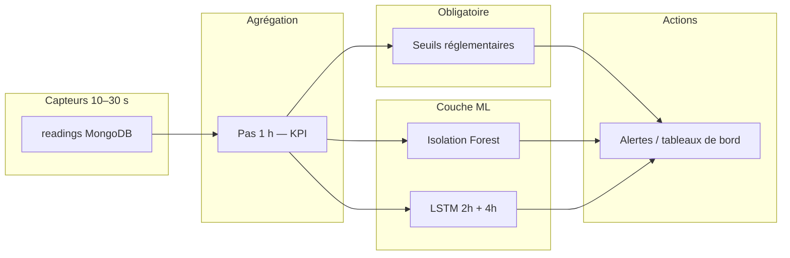

# Discussion modèles IA — Synthèse et recommandations

**Date de référence :** mai 2026  
**Contexte :** plateforme `pollution_monitoring` — pipeline notebooks 01–09, Isolation Forest (IF), LSTM 4 h / 24 h, seuils réglementaires MongoDB.  
**Rôle :** synthèse d’échanges d’analyse (ingénieur data / IA senior) et liste de tâches recommandées.

---

## 1. Vue d’ensemble de l’architecture cible

Le système ne repose pas sur un seul modèle, mais sur **trois couches complémentaires** :

| Couche | Rôle | Source de vérité |
|--------|------|-------------------|
| **Seuils réglementaires** | Dépassement ANPE / Décret 2018-928, alertes conformité | MongoDB (`polluants`, KPI horaires) |
| **Isolation Forest** | Anomalies **multivariées** non supervisées (combinaisons rares de polluants, capteurs) | `model_isolation_forest.pkl` |
| **LSTM (2 h / 4 h horaire)** | **Prévision** : 2 h = alertes serrées (souvent meilleur MAE/R²) ; 4 h = shift / conformité | `model_lstm_2h.h5`, `model_lstm_4h.h5` — voir `LSTM_INTEGRATION` |

**Référence :** `TRAINING_PLAN.md`, `config.py` (`ISOLATION_FOREST`, `LSTM_CONFIG`, `ZSCORE_ANOMALY_THRESHOLD`).

---

## 2. Isolation Forest + LSTM : choix « meilleurs » ou « adaptés » ?

### 2.1 Conclusion senior

| Question | Réponse |
|----------|---------|
| Sont-ils les **meilleurs modèles possibles** ? | **Non** — il n’existe pas de modèle unique optimal. |
| Sont-ils **adaptés à cette application** ? | **Oui**, comme **stack v1** : cadence **1 h**, inférence rapide (IF &lt; 100 ms, LSTM &lt; 500 ms), détection sans labels massifs, prévision 4 h / 24 h. |
| Que faire en production ? | **Ne pas remplacer les seuils** ; compléter par baselines, données locales MongoDB, et évaluation métier. |

### 2.2 Isolation Forest — forces et limites

**Adapté pour :**

- Détection **non supervisée** multivariée (NOX, SOX, PM25, PM10, CO2, COV, etc.).
- **Latence** faible, déploiement sklearn simple, réentraînement glissant (7 jours dans `config.py`).
- Complément aux seuils par polluant (profil « bizarre » sans dépassement unitaire).

**Limites :**

- Peu de **structure temporelle** si chaque ligne = un vecteur `(timestamp, site)` sans fenêtre glissante.
- « Anomalie IF » ≠ « dépassement réglementaire ».
- Données **synthétiques** (~50 % dans `training_dataset.csv`) peuvent biaiser le « normal ».

**Alternatives à envisager en v2 (si besoin) :** LOF, autoencodeur séquentiel, Mahalanobis sur features rolling ; en v1 garder IF + **Z-score / IQR** déjà prévus dans `config.py`.

### 2.3 LSTM — forces et limites

**Adapté pour :**

- Prévision **multivariée** à **4 h** et **24 h** avec lookback **48 h** (`LSTM_CONFIG`).
- Alignement avec agrégation KPI horaire et déclenchement scheduler côté backend.

**Limites :**

- Jeux publics hétérogènes (EPA, Beijing, UCI) + synthétiques : risque de **sous-performance** vs modèles plus simples.
- Faible **interprétabilité** pour les opérateurs.
- Souvent **égalé ou battu** par persistence / LightGBM sur lags à résolution horaire.

**Alternatives à envisager en v2 :** LightGBM/XGBoost sur lags + features notebook 02, Prophet, TFT / N-BEATS si volume de données locales suffisant.

---

## 3. Interprétation des résultats IF (discussion)

### 3.1 Taux sur validation / test (non injecté)

Exemple observé après entraînement (`contamination=0.05`) :

| Split | Anomalies | Taux |
|-------|-----------|------|
| Validation | 118 / 4746 | **2,5 %** |
| Test | 337 / 4746 | **7,1 %** |

**Lecture :**

- Ce ne sont **pas** des taux « trop bas » : ils sont du même ordre que le **5 %** visé par `contamination`.
- L’écart val/test reflète surtout un **décalage temporel** (split 70/15/15) : la dernière tranche peut être plus « bruitée » ou différente (CO2 synthétique, sites, saisons).
- Ces chiffres répondent à : *« combien de vecteurs horaires × site sont isolés ? »* — pas à *« combien d’incidents réglementaires ? »*.

### 3.2 Test d’injection (spikes / dérives)

**Problème identifié :** métrique « taux de détection **136 %** » calculée comme  
`(toutes les anomalies prédites sur le test augmenté) / (lignes injectées)` → peut dépasser 100 % et **ne pas** être un recall.

**Métriques correctes à utiliser :**

- **Recall injecté** = part des **lignes injectées** (spikes + dérives) effectivement flaggées.
- **Précision** (avec labels injectés) ≈ 0,70 et **recall** ≈ 1,0 dans un run typique : toutes les lignes cassées détectées, mais **faux positifs** supplémentaires sur le reste du test augmenté.

**Corrections apportées au notebook `04_isolation_forest_training.ipynb` :**

- Affichage du **recall sur indices injectés uniquement**.
- Exports `if_metrics.json` avec champs explicites (`injected_recall`, `anomalies_detected_val_pct`, etc.).
- Imports `joblib`, `classification_report` ; format d’impression des métriques compatible listes (`feature_cols`).

---

## 4. Écarts connus pipeline / production

| Sujet | État | Impact |
|-------|------|--------|
| IF : 6 polluants en pivot | NOX, SOX, PM25, PM10, CO2, COV | LSTM config : **8** features (`PM1`, `TEMPERATURE`, `HUMIDITY` dans `POLLUTANT_NAMES`) |
| Données synthétiques | CO2, partie PM10/COV | Biais entraînement tant que pas de fine-tuning MongoDB |
| Plan vs implémentation IF | Plan : 12 dimensions (8 + 4 stats) | Notebook 04 : pivot polluants seuls — **fenêtres rolling non passées à l’IF** |
| Seuils | MongoDB uniquement pour limites | Ne doivent **jamais** être remplacés par le score IF seul |

---

## 5. Tâches recommandées (backlog senior)

### 5.1 Priorité haute — avant mise en production

- [ ] **Geler la cartographie des features** : aligner IF, LSTM et inférence sur la même liste de colonnes que les capteurs réels (`POLLUTANT_NAMES` ou sous-ensemble documenté).
- [ ] **Valider les baselines de prévision** (notebooks 06–07) :
  - persistence (dernière valeur répétée) ;
  - naive saisonnière (même heure J-1) ;
  - optionnel : LightGBM sur lags + `hour_sin/cos`, `value_mean_6h`, etc.
  - **Ne déployer le LSTM que s’il bat clairement** ces baselines sur le test temporel.
- [ ] **Fine-tuning sur `readings` MongoDB** (phase prévue dans `TRAINING_PLAN.md`) : réentraîner IF et LSTM sur données locales, pas uniquement jeux publics + synthétiques.
- [ ] **Documenter le routage des alertes** :
  - dépassement seuil → alerte **réglementaire** ;
  - score IF → alerte **technique / multivariée** ;
  - prédiction LSTM 4 h au-dessus du seuil → alerte **anticipée** (avec incertitude).
- [ ] **Chaîne de détection hybride** : Z-score (`ZSCORE_ANOMALY_THRESHOLD`) → IF, comme indiqué dans `config.py`.
- [ ] **Évaluation métier IF** : croiser anomalies avec logs maintenance, incidents connus, dépassements seuil — pas seulement recall sur spikes injectés.

### 5.2 Priorité moyenne — qualité modèle

- [ ] **Enrichir les entrées IF** avec features du notebook 02 (`value_mean_6h`, `value_roc_1h`, `value_max_12h`) au lieu du seul pivot instantané.
- [ ] **Modèles par site** ou embedding `site_id` si plusieurs installations avec profils différents.
- [ ] **Calibrer `contamination`** sur le set de validation (scores `decision_function`) pour viser un taux d’alerte opérationnel acceptable.
- [ ] **Réentraînement planifié** : IF (fenêtre 7 jours) + LSTM (mensuel ou sur dérive RMSE) — procédure et versioning dans `ai_models`.
- [ ] **Exclure ou pondérer** les lignes `synthetic=true` à l’entraînement IF/LSTM quand des mesures réelles existent.

### 5.3 Priorité basse — évolutions v2

- [ ] Benchmark **LightGBM** vs LSTM sur les tenseurs de `05_lstm_training_preparation.ipynb`.
- [ ] Explorer **autoencodeur séquentiel** si les anomalies temporelles (dérive lente, capteur bloqué) dominent.
- [ ] Cadence **15 min** après suffisamment de données locales (paramètres déjà esquissés dans `TRAINING_PLAN.md`).
- [ ] Modèles type **TFT** si multi-sites + covariables météo / production disponibles.

### 5.4 Technique — notebooks et artifacts (déjà partiellement fait)

- [x] Corriger métrique injection IF (recall injecté, pas « 136 % »).
- [x] Exporter `if_metrics.json` avec métriques lisibles.
- [x] Imports `joblib` / `classification_report` dans notebook 04.
- [ ] Exécuter pipeline 05 → 06 → 07 et valider `lstm_*_metrics.json` vs baselines.
- [ ] Notebook 08 : latence IF &lt; 100 ms, LSTM &lt; 500 ms sur batch représentatif.
- [ ] Notebook 09 : E2E MQTT → MongoDB → FastAPI → alertes.

---

## 6. Mapping type d’alerte → responsable

| Type de situation | Couche responsable | Exemple |
|-------------------|-------------------|---------|
| Dépassement VLE / seuil ANPE actuel | **Seuils MongoDB** | NOX &gt; limite horaire |
| Pic isolé sur un polluant | **Z-score / IQR** + seuil | Capteur saturé |
| Combinaison atypique de polluants | **Isolation Forest** | NOX élevé, PM25 bas, CO2 cohérent |
| Tendance vers dépassement dans 4 h | **LSTM 4 h** + seuil sur prédiction | Anticipation ventilation |
| Planification / rapport 24 h | **LSTM 24 h** | Tendance journalière |

---

## 7. Références projet

| Fichier | Contenu |
|---------|---------|
| `TRAINING_PLAN.md` | Pipeline notebooks, cadence 1 h, horizons, intégration API |
| `config.py` | `POLLUTANT_NAMES`, `ISOLATION_FOREST`, `LSTM_CONFIG`, preprocessing |
| `notebooks/04_isolation_forest_training.ipynb` | Entraînement et évaluation IF |
| `notebooks/05_lstm_training_preparation.ipynb` | Tenseurs `(batch, 48, 8)` → `(batch, horizon, 8)` |
| `models/if_metrics.json` | Métriques exportées après run notebook 04 |

---

## 8. Synthèse en une phrase

**Isolation Forest et LSTM constituent un choix pragmatique et défendable pour la v1** de cette plateforme horaire, à condition de **maintenir les seuils réglementaires comme autorité principale**, de **valider le LSTM contre des baselines simples**, et de **réentraîner sur données locales** avant de considérer le stack comme « production-grade ».

---

*Document généré pour capitaliser la discussion d’analyse (taux d’anomalies IF, test d’injection, adéquation des modèles). À mettre à jour après fine-tuning MongoDB et résultats des notebooks 06–09.*
