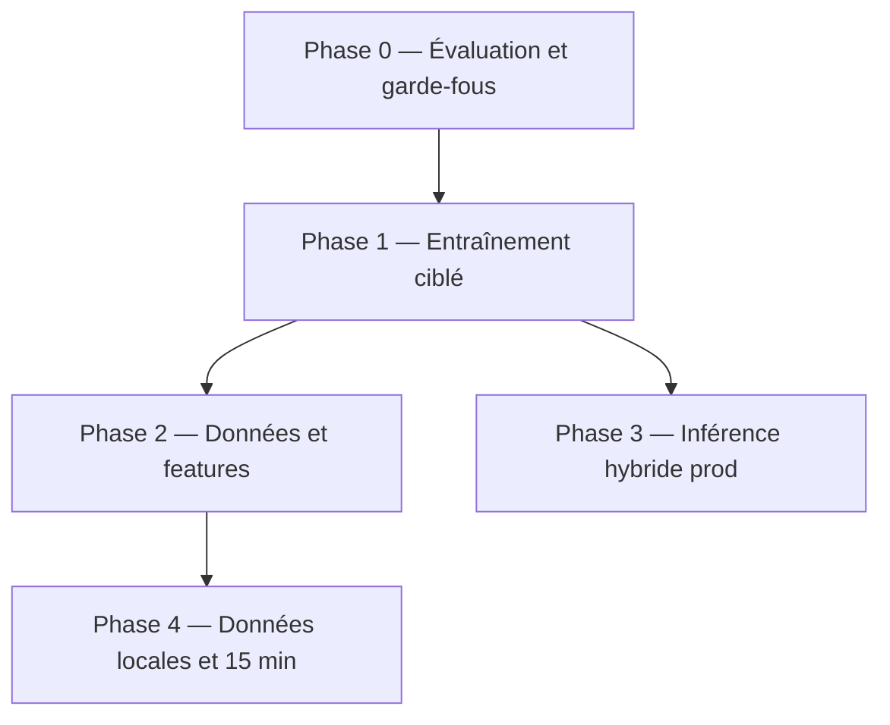

# Stratégie d’amélioration LSTM 4 h — post-analyse session

Document de référence pour corriger les problèmes observés lors de l’entraînement notebook **06** (run 57 epochs, `lstm_4h_metrics.json`).

**Constats session (résumé)**

| Symptôme | Preuve | Impact prod |
|----------|--------|-------------|
| MAE globale LSTM > persistance | ΔMAE +0.0027, `lstm_wins_mae: false` | Alertes peu fiables si on ne compare pas à la baseline |
| Persistance gagne à **chaque** pas (+1h…+4h) | MAE LSTM > pers. sur les 4 pas | Skill dynamique faible court terme |
| Prédictions **plates** (médian) | PNG `lstm_4h_predictions.png` | Opérateur voit peu de tendance |
| Échec sur **pics saturés** (cas difficile) | CO2/NOX sous-estimés à 1.0 | Seuils réglementaires / pics manqués |
| R² élevé mais trompeur | 0.94 global ; PM25/NOX mieux en pers. | Fausse confiance métrique |
| Gain réel sur **CO2, PM10, TEMPERATURE** | R² PM10 0.49 vs 0.13 (pers.) | Valeur ciblée, pas globale |
| Entraînement sain | val < train, pas d’overfitting | Le problème est **objectif + données + archi**, pas les epochs |

**Objectif stratégique**

> Déployer un MVP 4 h **honête** : battre la persistance sur les polluants utiles, fallback explicite ailleurs, métriques alignées métier (skill score, par site, déséchelle).

---

## Principes directeurs

1. **Mesurer le skill, pas seulement R²** — critère principal : `skill = 1 − MAE_model / MAE_persistence` (global, par pas, par polluant, par site).
2. **Ne pas optimiser ce que la persistance domine déjà** — NOX, SOX, PM25, humidité en horaire : fallback ou poids faible.
3. **Renforcer CO2 / PM10 / température** — seuls leviers où le LSTM a déjà un avantage mesurable.
4. **Séparer préparation (05) et entraînement (06)** — toute modification de tenseurs passe par 05 puis re-run 06.
5. **Pré-entraînement public ≠ prod** — stratégie en deux temps : améliorer le pipeline sur données actuelles, puis **ré-entraîner sur agrégats horaires MongoDB** (sites tunisiens).

---

## Phases et priorités



| Phase | Effort | Impact attendu | Bloquant prod ? |
|-------|--------|----------------|-----------------|
| **0** — Métriques & critères d’acceptation | Faible | Clarifie go/no-go | Non |
| **1** — Perte, pondération, early stopping skill | Moyen | Battre pers. sur CO2/PM10 global | Recommandé avant intégration |
| **2** — Features temps, eval par site, scaling | Moyen | Moins de prédictions plates multi-sites | Recommandé |
| **3** — Inférence hybride LSTM + persistance | Moyen | Fiabilité alertes même si MAE globale ≈ pers. | **Oui pour MVP** |
| **4** — Données prod + notebook 07 (15 min) | Élevé | Skill réel long terme | Non (post-MVP) |

---

## Phase 0 — Évaluation et garde-fous (immédiat)

**Problème adressé :** métriques agrégées trompeuses ; notebook 06 avec sorties parfois obsolètes.

### Modifications

| Fichier | Action |
|---------|--------|
| `ia/lstm_training.py` | Ajouter `skill_score(mae_model, mae_baseline)`, `evaluate_per_site(...)`, `acceptance_report(metrics) -> dict` |
| `ia/notebooks/06_lstm_training_4h_horizon.ipynb` | Cellule dédiée : skill global / par pas / par polluant / **par site** ; bar chart MAE LSTM vs pers. ; sauver `lstm_4h_skill_report.json` |
| `ia/config.py` | Bloc `LSTM_ACCEPTANCE` (seuils ci-dessous) |

### Seuils d’acceptation proposés (MVP 4 h, jeu test actuel)

```python
LSTM_ACCEPTANCE = {
    "min_global_skill": 0.02,          # skill global >= 2 % (MAE LSTM <= 98 % pers.)
    "min_pollutant_skill": {           # au moins battre pers. sur :
        "CO2": 0.05,
        "PM10": 0.08,
        "TEMPERATURE": 0.02,
    },
    "max_horizon_step_mae_ratio": {    # +1h ne doit pas être > 15 % pire que pers.
        "+1h": 1.15,
    },
    "allow_fallback_pollutants": [     # persistance autorisée en prod
        "NOX", "SOX", "PM25", "COV", "HUMIDITY",
    ],
}
```

### Critère de fin phase 0

- [ ] Rapport skill généré à chaque run 06
- [ ] `go_deploy: true/false` explicite dans JSON
- [ ] Documentation `AIService.integration.md` mise à jour avec règles fallback

---

## Phase 1 — Entraînement ciblé (cœur du correctif)

**Problèmes adressés :** MSE + 8 sorties → moyenne plate ; early stopping sur `val_loss` non aligné avec skill vs persistance.

### 1.1 Perte et pondération des sorties

| Fichier | Modification |
|---------|----------------|
| `ia/config.py` | Ajouter `loss_weights` par polluant (ex. CO2=2.0, PM10=2.0, NOX=0.3, PM25=0.3, …) ; option `"loss": "huber"` (déjà `huber_delta` présent) |
| `ia/lstm_training.py` | `build_weighted_loss(pollutant_names, weights)` ; `compile_lstm_model(..., loss=weighted)` |
| `ia/notebooks/06_...` | Utiliser la perte pondérée ; comparer run MSE vs Huber dans métriques |

**Hypothèse :** Huber + poids élevés sur CO2/PM10 réduit les prédictions plates sur variables à dynamique utile.

### 1.2 Early stopping sur skill (validation)

| Fichier | Modification |
|---------|----------------|
| `ia/lstm_training.py` | Callback `SkillVsPersistenceCallback` : chaque epoch, `y_val_pred` vs `persistence_baseline(X_val)` → `val_skill` |
| `ia/config.py` | `"early_stopping_monitor": "val_skill"` (ou garder `val_loss` en parallèle, arrêt sur le meilleur skill) |
| `ia/notebooks/06_...` | Logger `val_skill` dans `history` |

**Hypothèse :** le checkpoint « best » sera un modèle qui généralise mieux que la persistance, pas seulement un MSE bas.

### 1.3 Architecture légère (option A — minimal)

| Changement | Détail |
|------------|--------|
| Sortie **+1h** auxiliaire | Tête dense `horizon_1` + reshape 4h (multi-task) : force le réseau à apprendre le pas court |
| Ou **deux modèles** | `model_lstm_4h_co2_pm10.h5` (2 features) + modèle global léger pour le reste |

**Recommandation MVP :** commencer par **perte pondérée + Huber** ; n’ajouter multi-tête que si phase 1 insuffisante.

### 1.4 Hyperparamètres à tester (grille courte)

| Paramètre | Valeur actuelle | Essai |
|-----------|-----------------|-------|
| `dropout_rate` | 0.2 | 0.1 (moins de sous-apprentissage dynamique) |
| `lookback` | 48 | 24, 72 (sensibilité cycle) |
| `winsorize` | 1–99 % | 0.5–99.5 % ou winsor **par polluant** |

### Critère de fin phase 1

- [ ] `lstm_wins_mae: true` **ou** `global_skill >= 0.02`
- [ ] Skill CO2 ≥ 5 %, PM10 ≥ 8 %
- [ ] ΔMAE +1h ≤ +15 % vs persistance (ne pas dégrader l’alerte courte)
- [ ] Courbes : val_skill monte sans divergence train/val

---

## Phase 2 — Données, scaling et généralisation

**Problèmes adressés :** pics écrasés (winsor + MinMax) ; mélange multi-sites (Beijing domine) ; pas de signal calendrier.

### 2.1 Scaling et extrêmes

| Fichier | Modification |
|---------|----------------|
| `ia/notebooks/05_...` | Option `scaling_method: "robust"` (RobustScaler) ou log1p sur CO2/PM10 avant MinMax |
| `ia/lstm_training.py` | `scale_splits(..., method="robust")` ; métriques test en **espace physique** via `inverse_transform` |
| `ia/config.py` | `winsorize_per_pollutant: true` avec percentiles différents (CO2/PM10 moins agressif) |

**Hypothèse :** meilleure prédiction des cas difficile (saturation 1.0) et MAE interprétable en unités réelles.

### 2.2 Features exogènes (lookback inchangé)

Ajouter au tenseur d’entrée (répétées sur les 48 pas ou seulement au dernier pas — test A/B) :

| Feature | Encodage |
|---------|----------|
| `hour_sin`, `hour_cos` | cyclic 24 h |
| `dow_sin`, `dow_cos` | cyclic 7 j |
| `site_id` | embedding (si modèle par cluster) ou one-hot top-N sites |

| Fichier | Modification |
|---------|----------------|
| `ia/notebooks/05_...` | Construire `X` avec features calendrier ; mettre à jour `n_features` dans metadata |
| `ia/config.py` | `use_calendar_features: true`, `N_FEATURES` dynamique |
| `ia/notebooks/06_...` | `input_shape` lu depuis metadata |

### 2.3 Évaluation par site (diagnostic)

| Fichier | Modification |
|---------|----------------|
| `ia/lstm_training.py` | `evaluate_per_site(y, y_pred, site_ids)` |
| `ia/notebooks/05_...` | Sauver `site_id` par fenêtre dans `lstm_train_val_test.pkl` |
| `ia/notebooks/06_...` | Tableau skill par site ; identifier sites où pers. gagne toujours |

### 2.4 Stratégie de données (sans attendre MongoDB)

| Action | But |
|--------|-----|
| Entraînement **cluster A** : sites Beijing + EPA | Volume |
| Fine-tune **cluster B** : UCI + petits sites | Réduire biais |
| Ou **exclure** sites &lt; 500 fenêtres du train global | Moins de bruit |

### Critère de fin phase 2

- [ ] Skill par site documenté ; au moins 70 % des sites « volume » avec skill CO2 ou PM10 > 0
- [ ] MAE physique (ug/m³) reportée pour CO2/PM10
- [ ] Cas difficile : erreur relative sur pics &lt; 20 % (cible qualitative sur échantillon challenging)

---

## Phase 3 — Inférence hybride (prod MVP)

**Problème adressé :** même avec phase 1–2, NOX/SOX/PM25 resteront souvent mieux en persistance.

### Règle de décision en inférence

```
Pour chaque polluant p et horizon h:
  y_pers = dernière valeur lookback (répétée h fois)
  y_lstm = modèle 4h
  Si p in ALLOW_FALLBACK:
      y_out = y_pers
  Sinon si skill_validation[p] < seuil:
      y_out = blend(alpha * y_lstm + (1-alpha) * y_pers)  # alpha depuis métriques
  Sinon:
      y_out = y_lstm
```

| Fichier | Modification |
|---------|----------------|
| `ia/inference.py` (à créer ou étendre) | `predict_4h(X, site_id)` + chargement `lstm_scalers.pkl` + `baseline_comparison` depuis metrics |
| `ia/config.py` | `LSTM_INTEGRATION[4]["fallback_pollutants"]`, `"blend_alpha"` par polluant |
| `backend/.../AIService.js` | Documenter source `LSTM_4H` vs `PERSISTENCE_4H` dans payload alerte |
| `ia/docs/AIService.integration.md` | Contrat API + champs `prediction_source` |

### Critère de fin phase 3

- [ ] Chaque alerte indique `model | persistence | blend`
- [ ] Tests unitaires : fallback sur PM25 → sortie = dernière heure
- [ ] Pas de régression sur skill CO2/PM10 vs run phase 1

---

## Phase 4 — Données production et horizon tactique (post-MVP)

**Problème adressé :** dataset public horaire ≠ dynamique usine ; persistance trop forte.

| Étape | Livrable |
|-------|----------|
| Export MongoDB agrégats **horaires** par `siteId` | `training_dataset_prod_hourly.csv` |
| Re-run notebooks 01→05 sur données prod | Tenseurs sans mélange Beijing massif |
| Notebook **07** — pas 15 min, horizon 1–2 h | `model_lstm_tactical` (voir `TRAINING_PLAN.md`) |
| Réentraînement trimestriel | `drift_rmse_threshold` + skill monitoring |

---

## Matrice problème → action

| Problème session | Cause probable | Action prioritaire |
|------------------|----------------|-------------------|
| MAE LSTM > persistance global | Variables lentes dans la moyenne | Pondération + fallback polluants |
| Pire à +1h | Pas court non optimisé | Huber, poids +1h, early stop skill |
| Prédictions plates | MSE + multi-sortie | Perte pondérée ; option tête +1h |
| Pics sous-estimés | Winsor + MinMax | RobustScaler / log CO2-PM10 |
| R² élevé trompeur | Variance faible en [0,1] | Skill score + MAE physique |
| Bon CO2/PM10 seulement | Signal présent mais noyé | `loss_weights` + modèle ciblé optionnel |
| Beijing domine test | Concat multi-sites | Eval par site ; clusters ou modèle site |

---

## Ordre d’implémentation recommandé (sprints)

### Sprint 1 (1–2 j) — Mesure ✅

1. `skill_score`, `evaluate_per_site`, `LSTM_ACCEPTANCE` dans config
2. Cellule rapport + `lstm_4h_skill_report.json` dans notebook 06
3. Mise à jour `AIService.integration.md`

### Sprint 2 (2–3 j) — Entraînement ✅ (code)

1. `loss_weights` + Huber dans `lstm_training.py` / config
2. Callback `val_skill` + checkpoint sur meilleur skill
3. Re-run 05 → 06 ; comparer métriques avant/après

### Sprint 3 (2 j) — Données

1. Features calendrier dans notebook 05
2. RobustScaler ou winsor par polluant
3. Eval par site + graphiques

### Sprint 4 (2 j) — Prod ✅ (code)

1. `ia/inference.py` — `LSTM4HPredictor` (LSTM + persistance + blend)
2. `ia/api.py` — `POST /predict`
3. Intégration `AIService.js` backend — à brancher

### Sprint 3 (2 j) — Données ✅ (code)

1. Features calendrier dans notebook **05** (`hour_sin/cos`, `dow_sin/cos`)
2. Entrée 12 / sortie 8 — **obligatoire : re-run 05 puis 06** (ancien modèle 8→8 incompatible)

### Sprint 5 (plus tard) — Données réelles

1. Pipeline export horaire MongoDB
2. Ré-entraînement ; puis notebook 07 (15 min)

---

## Métriques de succès (definition of done)

| Métrique | Baseline session | Cible post-stratégie |
|----------|------------------|----------------------|
| Skill global | ~−9 % (MAE LSTM > pers.) | **≥ +2 %** |
| Skill CO2 | ~+7 % (MAE) | **≥ +10 %** |
| Skill PM10 | ~+3 % | **≥ +10 %** |
| MAE +1h / MAE pers. +1h | 1.27 | **≤ 1.10** |
| `lstm_wins_mae` global | false | **true** ou fallback documenté |
| Prédictions médian (visuel) | plates | pente visible sur ≥2 polluants cibles |

---

## Hors scope (éviter la dispersion)

- Réintroduire modèle **2 h** global sans critère skill (abandonné pour R² test faible — réévaluer seulement si skill +1h l’impose).
- Modèle **24 h** horaire.
- Augmenter `epochs` au-delà de 100 sans changer perte/métrique.
- Architecture lourde (Transformers, ensemble) avant d’épuiser phases 0–2.

---

## Fichiers impactés (checklist)

```
ia/config.py                          # LSTM_ACCEPTANCE, loss_weights, scaling, features
ia/lstm_training.py                   # skill, weighted loss, callbacks, per-site eval
ia/notebooks/05_lstm_training_preparation.ipynb
ia/notebooks/06_lstm_training_4h_horizon.ipynb
ia/inference.py                       # hybride LSTM + persistance
ia/docs/AIService.integration.md
ia/docs/TRAINING_PLAN.md              # lien vers ce document
backend/.../AIService.js              # source prédiction
```

---

## Références

- Métriques session : `ia/models/lstm_4h_metrics.json` (`baseline_comparison`)
- Plan cadence / 15 min : `ia/docs/TRAINING_PLAN.md`
- Intégration prod : `ia/docs/AIService.integration.md`

---

*Dernière mise à jour : aligné sur l’analyse du run 57 epochs (MAE 0.033, R² 0.94, persistance gagne en MAE globale).*
