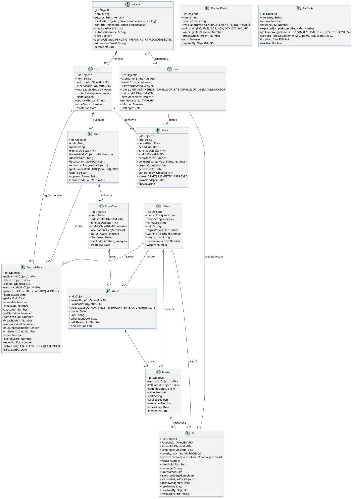
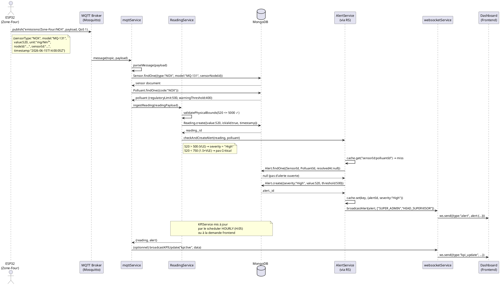
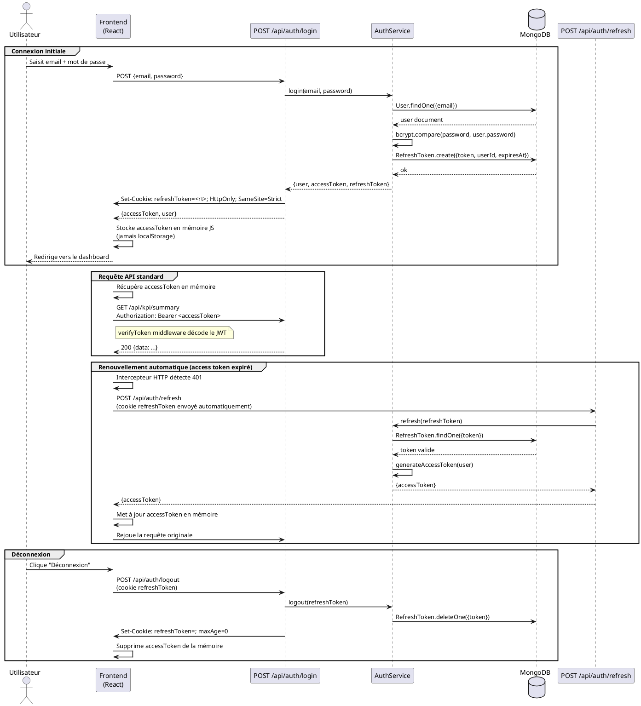
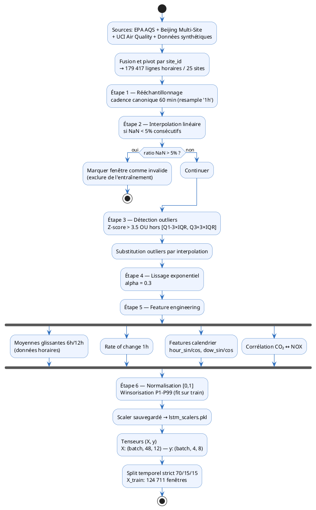

# Chapitre 2 — Conception et architecture technique du système
## (Suite — à partir de II.4.2)

---

## II.4.2 — Modélisation des données

### Justification du choix de MongoDB

Le système EmissionsIQ repose sur MongoDB comme système de gestion de bases de données pour des raisons structurelles directement liées à la nature des données de surveillance environnementale. La première raison est l'hétérogénéité des schémas : une installation industrielle tunisienne peut comporter des capteurs de types très différents (NDIR pour le CO₂, laser pour les particules, MOS pour les composés organiques), produisant des mesures dans des unités et à des fréquences variées. Un schéma relationnel rigide obligerait à multiplier les tables et les jointures pour accommoder cette diversité, alors que MongoDB permet d'adapter la structure de chaque document à la nature du capteur concerné.

La deuxième raison est la gestion des séries temporelles à haute fréquence. La collection `readings` reçoit des mesures toutes les 10 à 30 secondes par capteur actif, ce qui représente environ 40 000 documents par jour pour une installation standard. MongoDB gère nativement ce volume grâce à ses capacités d'indexation composée et son stockage orienté documents, sans nécessiter les transformations coûteuses d'un système relationnel. Les quatre index définis sur la collection `readings` — `{ timestamp: -1 }`, `{ sensorId: 1, timestamp: -1 }`, `{ PolluantId: 1, timestamp: -1 }` et `{ nodeId: 1, timestamp: -1 }` — permettent de répondre aux requêtes de filtrage temporel les plus fréquentes en O(log n).

La troisième raison est la dénormalisation contrôlée. Plutôt que de recalculer les jointures hiérarchiques à chaque requête KPI, le modèle stocke des références redondantes (`industrieId` dans `Zone`, `siteId` dans `SensorNode`) pour éviter des chaînes de population coûteuses lors des calculs d'agrégation.

### Hiérarchie organisationnelle du modèle

Le modèle de données d'EmissionsIQ suit une hiérarchie à six niveaux reflétant fidèlement la réalité organisationnelle d'une installation industrielle tunisienne soumise au Décret 2018-928. Prenons l'exemple concret d'une cimenterie à Sfax : la société **CIMENT SFAX SA** constitue l'entité `Industrie`, enregistrée avec son matricule fiscal, son numéro d'autorisation ANPE et ses coordonnées GPS dans le gouvernorat de Sfax. Cette industrie possède un ou plusieurs `Site` physiques, par exemple le site principal « Cimenterie Sfax - Principale » avec sa localisation GeoJSON. Chaque site est subdivisé en `Zone` de surveillance : on y trouvera « Zone-Four » (fours de calcination), « Zone-Broyage » (unité de concassage), « Zone-Stockage » et « Zone-Expedition », chacune identifiée par un code court et une liste de polluants surveillés parmi `["CO2", "NOX", "SO2", "PM", "COV"]`.

Dans chaque zone est installé un ou plusieurs `SensorNode`, représentant un nœud ESP32 physique. Ce nœud, identifié par son adresse MAC unique (`macAddress`), porte à son tour plusieurs `Sensor` logiques, chacun associé à un modèle physique précis (`MH-Z19B` pour le CO₂, `SDS011` pour les PM2.5, etc.) et à une fréquence de mesure. Toute mesure effectuée par un capteur génère un document `Reading` horodaté contenant la valeur brute et la valeur convertie, le flag de validité, et des références directes au capteur, au nœud et au polluant. Lorsque la valeur mesurée franchit un seuil réglementaire, une `Alert` est créée ou mise à jour, référençant le polluant en dépassement, le capteur source, et la lecture déclenchante.

### Diagramme de classes UML

### Choix de conception notables

**Dénormalisation partielle.** La collection `Zone` stocke le champ `industrieId` en plus du `siteId` attendu, et la collection `SensorNode` stocke à la fois `zoneId` et `siteId`. Cette dénormalisation est délibérée : les calculs KPI doivent fréquemment scoper les mesures à une zone ou un site précis sans remonter toute la chaîne de jointures. Sans ce choix, chaque requête d'agrégation nécessiterait une opération de population en cascade (`Zone → Site → Industrie`), multipliée par le volume de lectures. Le surcoût de stockage est négligeable (deux ObjectId supplémentaires par document) par rapport au gain en latence des requêtes de calcul des indicateurs de performance.

**Collection AggregateData et agrégation planifiée.** La collection `AggregateData` constitue le cœur du système de reporting. Plutôt que de recalculer les KPIs à la volée depuis les 40 000 mesures quotidiennes à chaque requête du dashboard, le système maintient une couche d'agrégation précalculée selon quatre granularités temporelles : `HOURLY`, `DAILY`, `WEEKLY` et `MONTHLY`. Ces agrégations sont produites automatiquement par le scheduler `kpiScheduler.js`, implémenté avec la bibliothèque `node-cron`. Les expressions cron définies dans le code sont : `"5 * * * *"` pour l'agrégation horaire (à H:05 de chaque heure), `"10 0 * * *"` pour l'agrégation quotidienne (à 00:10), `"20 0 * * 1"` pour l'agrégation hebdomadaire (lundis à 00:20), et `"30 0 1 * *"` pour l'agrégation mensuelle (1er du mois à 00:30). Chaque document d'agrégation stocke non seulement les statistiques brutes (`minValue`, `maxValue`, `avgValue`, `stdDeviation`, `sampleCount`) mais également les KPIs calculés (`tauxDepassement`, `emissionKgDay`, `score`, `overallScore`, `reductionPct`) ainsi qu'un indicateur de qualité des données (`dataQuality`: EXCELLENT/GOOD/FAIR/POOR) calculé en comparant le nombre de mesures reçues au nombre attendu selon la fréquence configurée dans `SiteConfig.expectedSampleIntervalSeconds`.

**Index de performance sur la collection readings.** La collection `Reading` est celle qui supporte la charge la plus élevée du système, tant en écriture (toutes les 10 secondes par capteur) qu'en lecture (requêtes KPI, graphiques historiques). Quatre index composés ont été définis pour couvrir les patterns d'accès les plus fréquents : `{ timestamp: -1 }` pour les requêtes « les N dernières mesures », `{ sensorId: 1, timestamp: -1 }` pour l'historique d'un capteur spécifique, `{ PolluantId: 1, timestamp: -1 }` pour les graphiques de tendance d'un polluant sur le dashboard, et `{ nodeId: 1, timestamp: -1 }` pour les requêtes KPI scopées à un nœud. L'ordre décroissant sur le timestamp est intentionnel : les requêtes les plus fréquentes concernent toujours les données les plus récentes, ce qui permet à MongoDB d'utiliser le préfixe de l'index sans scan complet de collection.

**Déduplication des alertes.** Une conception naïve du moteur d'alertes créerait un nouveau document `Alert` pour chaque mesure en dépassement, générant potentiellement des milliers d'alertes redondantes lors d'un incident continu. EmissionsIQ résout ce problème par une déduplication en deux niveaux : un cache en mémoire `_activeAlerts` (Map JavaScript) conserve une référence à l'alerte ouverte par paire `(sensorId, polluantId)`, et un mécanisme de vérification en base garantit la cohérence après redémarrage via la méthode `_warmUpCache()`. Lorsqu'une mesure en dépassement arrive alors qu'une alerte active existe déjà pour le même capteur et polluant, le système met simplement à jour l'alerte existante en place (`alertRepository.updateActive()`) plutôt que d'en créer une nouvelle, à condition que la fenêtre de mise à jour `UPDATE_WINDOW_MS` (30 secondes par défaut, configurable via la variable d'environnement `ALERT_UPDATE_WINDOW_MS`) soit expirée ou que la sévérité ait augmenté (escalade).

---

## II.4.3 — Architecture backend : services métier

### Organisation en couches

L'architecture backend d'EmissionsIQ suit un découpage en couches strictement délimité, visant à séparer les responsabilités et à faciliter la testabilité de chaque composant. La requête HTTP entrante est d'abord reçue par la couche **Routes**, qui valide le format de la requête et applique les middlewares d'authentification (`verifyToken`) et de contrôle d'accès (`checkRole`, `checkMinRole`). Elle est ensuite transmise à la couche **Controllers**, dont la seule responsabilité est d'extraire les paramètres de la requête HTTP, d'appeler le service métier approprié, et de formater la réponse JSON. Le controller ne contient aucune logique métier.

La logique métier réside entièrement dans la couche **Services**, qui orchestre les opérations complexes faisant intervenir plusieurs entités. C'est à ce niveau que résident les calculs KPI, la détection des dépassements de seuil, la gestion du cycle de vie des alertes et la communication avec le broker MQTT. Enfin, la couche **Repositories** encapsule toutes les interactions avec MongoDB via les modèles Mongoose, offrant une interface de données stable qui peut être mockée lors des tests unitaires. Cette organisation en quatre couches (Routes → Controllers → Services → Repositories) garantit que chaque modification de la structure de la base de données reste confinée à la couche Repository, sans propager de changements aux couches supérieures.

### Les cinq services clés

**ReadingService.** Ce service constitue le point d'entrée de toutes les mesures capteurs dans le système, qu'elles proviennent du broker MQTT ou d'un appel API direct. Sa méthode principale `ingestReading(data)` reçoit un payload contenant l'identifiant du capteur, l'identifiant du polluant, l'identifiant du nœud, la valeur mesurée et l'horodatage. Elle commence par vérifier l'existence et l'état actif du capteur et du polluant en base, puis applique une validation de plausibilité physique rejetant toute valeur supérieure à dix fois la VLE réglementaire (valeurs indicatives d'une panne capteur). La mesure est ensuite persistée dans la collection `readings` avec son flag `isValid`, et le moteur d'alertes `checkAndCreateAlert()` est appelé si la mesure est valide. Ce service gère également le cache en mémoire des alertes ouvertes, initialisé au démarrage par `_warmUpCache()` pour garantir la cohérence après redémarrage sans fenêtre d'alertes dupliquées.

**AlertService.** Ce service est responsable de toute la logique de cycle de vie des alertes, depuis leur création jusqu'à leur résolution. Il expose les méthodes `acknowledgeAlert(id, userId)`, `escalateAlert(id, newSeverity, reason)` et `resolveAlert(id, userId, note)`, chacune implémentant des règles de transition d'état strictes : une alerte ne peut être acquittée qu'une seule fois (erreur 409 si déjà acquittée), et une alerte résolue est immuable. La logique de déduplication et de création d'alertes est en réalité implémentée dans `ReadingService.checkAndCreateAlert()`, qui délègue la persistance à `AlertRepository`. L'`AlertService` gère trois niveaux de sévérité — `Warning`, `High` et `Critical` — correspondant respectivement à un dépassement du seuil d'avertissement (`warningThreshold`), de la VLE (`regulatoryLimit`) et de 1,5 fois la VLE. Ces valeurs sont lues directement depuis la collection `polluants` en base, garantissant leur synchronisation avec la configuration ANPE de l'administrateur.

**KPIService.** Ce service implémente les quatre indicateurs de performance environnementale définis par la norme NT 106.04. Il expose des méthodes asynchrones distinctes pour chacun des KPIs, permettant leur calcul à la demande ou en mode agrégé planifié. Le **Taux de Dépassement (TD)** est calculé par `calculateTD(polluantId, periodStart, periodEnd)` selon la formule `TD = (N_breach / N_total) × 100`, où `N_breach` est le nombre de mesures valides dont la valeur dépasse la `regulatoryLimit` du polluant. L'**Émission Moyenne par Jour (EMJ)** est calculée par `calculateEMJ()` selon la formule `EMJ = C_moy × Q_air × 86400 × 10⁻⁶ kg/jour`, où `Q_air` est le débit volumique en Nm³/s lu depuis la configuration du site (`SiteConfig.airflow`, défaut 2,0 Nm³/s). L'**Indice de Performance Environnementale (IPE)** est calculé par `calculateIPE()` comme une moyenne pondérée des scores de conformité de chaque polluant, avec les poids par défaut `{NOx: 0.30, SO2: 0.25, PM25: 0.25, COV: 0.15, CO2: 0.05}`. La **Réduction CO₂ (RCO2)** est calculée par `calculateRCO2()` en comparant l'EMJ de la période courante à celle d'une période de référence, selon `RCO2 = [(EMJ(T) - EMJ(T0)) / EMJ(T0)] × 100`. Tous ces calculs supportent un filtre optionnel `nodeIdFilter` permettant de scoper le calcul à une zone précise.

**mqttService.** Ce service établit et maintient la connexion au broker MQTT (Mosquitto, par défaut `mqtt://localhost:1883`, configurable via `MQTT_BROKER`). Au démarrage, il crée un client MQTT avec l'identifiant `pollution-backend-<random>` et s'abonne au topic générique `emissions/#` avec QoS 1, ce qui garantit la livraison d'au moins une fois de chaque message publié par les nœuds ESP32. À la réception d'un message, la fonction `processMessage(topic, payload)` parse le JSON, résout l'identifiant du capteur en base depuis le triplet `(sensorType, model, nodeId)`, résout l'identifiant du polluant depuis le champ `code`, puis construit le payload pour `ReadingService.ingestReading()`. Le service gère les reconnexions automatiques avec une période de 2 secondes (`reconnectPeriod: 2000`), assurant la résilience aux micro-coupures réseau fréquentes dans les environnements industriels.

**websocketService.** Ce service gère les connexions WebSocket persistantes avec les clients du dashboard, permettant la diffusion en temps réel des mises à jour KPI et des alertes. Le serveur WebSocket est initialisé sur le chemin `/ws` du même serveur HTTP Express, évitant l'ouverture d'un port supplémentaire. Chaque client est identifié par un identifiant unique `client_<timestamp>_<random>` et stocké dans une `Map` associant l'ID client à ses métadonnées (userId, rôle, topics souscrits). Le protocole de messagerie est simple et basé sur JSON : le client s'authentifie via un message `{ type: "authenticate", payload: { userId, role, email } }`, puis souscrit aux topics KPI souhaités via `{ type: "subscribe", payload: { topics: ["kpi:daily", "kpi:hourly"] } }`. La diffusion utilise deux méthodes distinctes : `broadcastKPIUpdate(topic, data)` envoie les mises à jour KPI aux clients abonnés au topic concerné, et `broadcastAlert(alert, allowedRoles)` envoie les nouvelles alertes uniquement aux rôles autorisés (par défaut `SUPER_ADMIN` et `HEAD_SUPERVISOR`).

### Diagramme de séquence — flux d'une lecture capteur

### Tableau de synthèse des groupes de routes

| Domaine | Endpoints principaux |
|---|---|
| Authentification | `/api/auth` — login, register, refresh, logout, me |
| Industries | `/api/industries` — CRUD industries, workflow approbation |
| Sites | `/api/sites` — gestion sites, approbation SUPER_ADMIN |
| Zones | `/api/zones` — gestion zones, assignation opérateurs |
| Utilisateurs | `/api/users` — gestion RBAC, création comptes |
| Nœuds capteurs | `/api/sensor-nodes` — enregistrement ESP32, statut |
| Capteurs | `/api/sensors` — configuration capteurs logiques |
| Polluants | `/api/polluants` — référentiel polluants et VLE |
| Lectures | `/api/readings` — ingestion mesures, historique |
| Alertes | `/api/alerts` — liste, acquittement, résolution, stats |
| KPIs | `/api/kpi` — calcul TD/EMJ/IPE/RCO2, historique, config |
| Rapports | `/api/reports` — génération PDF/CSV, liste, téléchargement |
| Module IA | `/api/ia` — prédictions LSTM, détection anomalies, réentraînement |
| Configuration seuils | `/api/thresholds` — gestion ThresholdConfig |
| Configuration site | `/api/site-config` — airflow, poids IPE, objectifs |

---

## II.4.4 — Sécurité et contrôle d'accès

### Mécanisme JWT dual-token

La sécurité des échanges entre le frontend React et le backend Node.js repose sur une architecture JWT à deux tokens aux durées de vie et modes de stockage distincts. L'**access token** a une durée de vie de 15 minutes (configurable via `JWT_ACCESS_EXPIRES`), il est signé avec le secret `JWT_ACCESS_SECRET` et son payload contient `{ userId, email, role, zone }`. Ce token est renvoyé dans le corps de la réponse de login et stocké exclusivement en mémoire JavaScript du frontend, jamais dans `localStorage` ni `sessionStorage`. Ce choix protège contre les attaques XSS (Cross-Site Scripting) : un script malveillant injecté dans la page ne peut pas accéder à une variable JavaScript de l'application React si elle est correctement encapsulée.

Le **refresh token** a une durée de vie de 7 jours (configurable via `JWT_REFRESH_EXPIRES`). Il est signé avec un secret distinct `JWT_REFRESH_SECRET`, stocké en base de données dans la collection `RefreshToken`, et transmis au client uniquement via un cookie `HttpOnly`. La configuration du cookie est définie dans `jwt.js` : `{ httpOnly: true, secure: true (production), sameSite: "strict" (production) / "lax" (développement), maxAge: 7*24*60*60*1000 }`. Un cookie `HttpOnly` est fondamentalement inaccessible au JavaScript navigateur, rendant toute tentative de vol par injection XSS inopérante. L'attribut `sameSite: "strict"` bloque en outre les requêtes cross-site, réduisant la surface d'attaque CSRF. Lorsque l'access token expire, le frontend appelle silencieusement `POST /api/auth/refresh` : le cookie est envoyé automatiquement par le navigateur, et si le refresh token en base est valide et non révoqué, un nouvel access token est émis sans interruption de la session utilisateur.

### Diagramme de séquence — flux d'authentification

### Contrôle d'accès basé sur les rôles (RBAC)

Le système définit cinq rôles organisés en hiérarchie stricte, implémentée dans `checkRole.js` via la constante `ROLE_HIERARCHY` : `SUPER_ADMIN` (niveau 5), `HEAD_SUPERVISOR` (niveau 4), `SITE_SUPERVISOR` (niveau 3), `AUDITOR` (niveau 2) et `OPERATOR` (niveau 1). Cette hiérarchie est utilisée par le middleware `checkMinRole(minRole)` pour autoriser automatiquement tous les rôles d'un niveau supérieur ou égal au minimum requis.

| Rôle | Responsabilité | Permissions clés | Restrictions |
|---|---|---|---|
| `SUPER_ADMIN` | Administrateur plateforme | Toutes les opérations, configuration des seuils réglementaires (`configure_thresholds`), approbation industries/sites, lancement pipelines IA (`run_ia`) | Aucune |
| `HEAD_SUPERVISOR` | Directeur industriel | Gestion industries, sites, nœuds, rôles (`manage_industries`, `manage_nodes`, `manage_roles`), génération rapports, accès module IA | Limité à son `industryId` |
| `SITE_SUPERVISOR` | Responsable de site | Gestion opérateurs (`manage_operators`), gestion nœuds, acquittement alertes, export données | Limité à ses `sitesManaging` |
| `OPERATOR` | Opérateur terrain | Consultation données temps réel (`view_live_data`), acquittement alertes, calibration capteurs (`calibrate_sensors`) | Filtré sur ses `zonesAssigned` uniquement via `checkZone` |
| `AUDITOR` | Auditeur ANPE/interne | Consultation historique (`view_history`), génération rapports, export PDF/CSV | Lecture seule, pas d'écriture |

### Isolation des données par zone

Le middleware `checkZone` implémente l'isolation des données pour les opérateurs. Son fonctionnement est simple : si le rôle de l'utilisateur authentifié n'est pas `OPERATOR`, le middleware passe immédiatement à la suite de la chaîne (`next()`) sans restriction. Si le rôle est `OPERATOR` et qu'aucune zone n'est assignée (`req.user.zone === null`), l'accès est refusé avec un message explicite invitant l'opérateur à contacter son superviseur. Si l'opérateur a une zone assignée, le middleware injecte le filtre dans l'objet requête (`req.zoneFilter = zone`), et les controllers utilisant ce filtre restreignent automatiquement les lectures, alertes et KPIs retournés aux données de la zone concernée.

---

## II.4.5 — Module d'intelligence artificielle : conception

### Positionnement et règle architecturale fondamentale

Le module d'intelligence artificielle d'EmissionsIQ est implémenté comme un microservice Python indépendant exposant une API FastAPI sur le port 8000. La règle architecturale la plus importante de ce module est que **le microservice Python est strictement read-only vis-à-vis de la collection d'alertes MongoDB**. Le service IA ne crée jamais directement d'alerte en base de données : il retourne uniquement des scores et des prédictions à Node.js via des appels HTTP, et c'est Node.js qui décide seul, selon sa propre logique métier dans `ReadingService`, de créer ou non un document `Alert`.

Ce choix est justifié par le principe de cohérence du domaine d'alerte dans un seul service décisionnel. Si le microservice Python créait ses propres alertes en parallèle de Node.js, il y aurait deux sources de vérité pour les alertes, rendant la déduplication impossible et violant le contrat de fonctionnement du cache `_activeAlerts`. De plus, la collection `Alert` est liée à des workflows précis (acquittement, résolution, escalade) dont la logique est encapsulée dans `AlertService.js`. Faire accéder directement le Python à cette collection contournerait ces règles et introduirait un couplage fort entre deux services qui doivent rester déployables indépendamment.

L'architecture IA s'organise en trois couches complémentaires selon la documentation `DISCUSSION_MODELES_IA_RECOMMANDATIONS.md` : les **seuils réglementaires** (MongoDB, autorité principale), l'**Isolation Forest** pour les anomalies multivariées non supervisées, et le **LSTM 4 h** pour la prévision de tendances à horizon opérationnel. Cette stratification garantit que la couche de seuils réglementaires reste souveraine, le LSTM ne venant qu'en complément anticipatif.

### Pipeline de prétraitement

Le pipeline de prétraitement, défini dans le fichier `preprocessor.py` et documenté dans `TRAINING_PLAN.md`, transforme les séries temporelles brutes issues des trois sources de données (datasets publics EPA AQS, Beijing Multi-Site, UCI Air Quality) en tenseurs normalisés exploitables par les modèles. Les paramètres de chaque étape sont centralisés dans le dictionnaire `PREPROCESSING` de `config.py`. Le pipeline comporte six étapes séquentielles.

La première étape est le **rééchantillonnage** : les mesures brutes arrivent à des fréquences hétérogènes selon le capteur (10 secondes pour CO₂ et température, 15 secondes pour PM25, 30 secondes pour NOX, SO₂ et COV). Les datasets publics sont nativement à la cadence horaire. Le rééchantillonnage unifie ces séries sur la **cadence canonique de 1 heure** (`timestep_minutes: 60`), alignée sur le scheduler `kpiScheduler.js` (agrégation HOURLY) et sur les datasets publics d'entraînement.

La deuxième étape est l'**interpolation des valeurs manquantes** : les lacunes dans la série (capteur hors ligne, perte de connexion MQTT) sont comblées par interpolation linéaire, à condition que le ratio de NaN consécutifs ne dépasse pas le seuil `max_nan_ratio: 0.05` (5%). Au-delà de ce seuil, la fenêtre est marquée comme inutilisable pour l'entraînement.

La troisième étape est la **suppression des outliers** via une méthode hybride. Les valeurs dont le Z-score absolu dépasse `zscore_threshold: 3.5` sont d'abord identifiées. Cette détection est complétée par la méthode IQR (interquartile range) : toute valeur hors de l'intervalle `[Q1 - 3.0×IQR, Q3 + 3.0×IQR]` (multiplicateur `iqr_multiplier: 3.0`) est substituée par interpolation.

La quatrième étape est le **lissage exponentiel** avec un facteur `ema_alpha: 0.3`. Cette valeur d'alpha faible produit un lissage prononcé qui atténue le bruit électronique des capteurs MOS (MQ-131, MQ-136) dont la réponse est naturellement bruitée, sans écraser les tendances réelles de variation de concentration.

La cinquième étape est le **feature engineering** : des features temporelles dérivées sont calculées pour enrichir le tenseur d'entrée du LSTM. Cela inclut les moyennes glissantes sur 10 minutes (`rolling_window_10m: 60` points) et 30 minutes (`rolling_window_30m: 180` points), ainsi qu'un terme de corrélation croisée CO₂ ↔ NOX calculé sur une fenêtre de 5 minutes (`cross_corr_window: 30` points). Cette corrélation capture la co-émission typique des procédés de combustion industrielle. Le notebook 05 ajoute également quatre features calendrier encodées cycliquement : `hour_sin`, `hour_cos`, `dow_sin`, `dow_cos`, portant le vecteur d'entrée du LSTM à 12 dimensions (`N_INPUT = 12`).

La sixième et dernière étape est la **normalisation** dans l'intervalle [0, 1] par winsorisation des percentiles 1% et 99% (`winsorize_lower_pct: 1.0`, `winsorize_upper_pct: 99.0`), appliquée uniquement sur l'ensemble d'entraînement (scaler `MinMaxScaler` sauvegardé dans `lstm_scalers.pkl` pour les inférences futures).

### Modèle LSTM pour la prédiction de tendances

Les réseaux de neurones LSTM (Long Short-Term Memory) sont particulièrement adaptés à la prédiction de séries temporelles industrielles car ils maintiennent un état interne à long terme (cellule de mémoire) permettant de capturer des dépendances temporelles étendues, comme les cycles journaliers d'une installation en trois-huit ou les pics de production hebdomadaires d'une cimenterie tunisienne. Contrairement aux réseaux récurrents simples (RNN) qui souffrent du problème de disparition du gradient pour les longues séquences, les LSTM régulent explicitement le flux d'information via leurs trois portes (entrée, oubli, sortie).

L'architecture retenue dans `config.py` et implémentée par la fonction `build_lstm_model()` de `lstm_training.py` utilise une fenêtre de lookback de **48 heures** (`lookback: 48` pas horaires), capturant deux cycles jour/nuit complets. L'horizon de prédiction est de **4 heures** (`horizon_short: 4` pas), correspondant aux besoins opérationnels de planification de quart et de conformité réglementaire. Le réseau est structuré comme suit : une couche **Input(48, 12)** — 12 features incluant les 8 polluants et les 4 features calendrier — suivie d'une première couche **LSTM(64 unités, activation relu, return_sequences=True)** avec Dropout(0,2), d'une deuxième couche **LSTM(32 unités, activation relu)** avec BatchNormalization et Dropout(0,2), puis d'une couche **Dense(16 unités, relu)**, et enfin d'une couche de sortie `Dense(4×8=32)` remodélisée en `Reshape(4, 8)`. Le modèle totalise **32 304 paramètres entraînables** (126 Ko).

La fonction de perte est la **perte de Huber pondérée** (`loss: "huber"`, `delta: 0.05`) avec des poids différenciés par polluant : CO₂ et PM10 pondérés à 2,0 (polluants prioritaires avec signal utile), TEMPERATURE à 1,2, et les autres (NOX, SOX, PM25, COV, HUMIDITY) à 0,3–0,5. L'arrêt anticipé est contrôlé par le callback `SkillVsPersistenceCallback` avec une patience de 15 époques (`early_stopping_monitor: "val_skill"`), assurant que le checkpoint sauvegardé correspond au modèle maximisant l'écart de performance par rapport à la baseline de persistance naïve. Un mécanisme de réentraînement automatique est prévu si la dégradation du RMSE dépasse 20% (`drift_rmse_threshold: 0.20`).

### Isolation Forest pour la détection d'anomalies

L'algorithme Isolation Forest (Liu et al., 2008) détecte les anomalies par un principe d'isolement plutôt que de modélisation du comportement normal. Il construit un ensemble de 100 arbres de décision aléatoires (`n_estimators: 100`), chacun partitionnant récursivement l'espace des features en sélectionnant aléatoirement une feature et une valeur de coupure. Une anomalie étant par définition une observation rare et différente de la masse, elle s'isole naturellement en peu de partitions, c'est-à-dire à faible profondeur dans l'arbre. Le score d'anomalie est inversement proportionnel à la profondeur d'isolation moyenne sur l'ensemble des arbres.

Le taux de contamination est fixé à 5% (`contamination: 0.05`). Le modèle est entraîné sur 22 146 vecteurs horaires à 6 dimensions (`IF_FEATURE_NAMES: ["NOX", "SOX", "PM25", "PM10", "CO2", "COV"]`), avec un StandardScaler préalable (mean=0, std=1). Un pré-filtre Z-score (`ZSCORE_ANOMALY_THRESHOLD: 3.0`) est appliqué avant le modèle pour signaler les dépassements unitaires évidents sans solliciter l'inférence complète. L'avantage fondamental de cette approche pour le contexte EmissionsIQ est son caractère **non supervisé** : aucune donnée étiquetée "anomalie/normal" n'est nécessaire pour l'entraînement, ce qui est critique pour les nouvelles installations industrielles sans historique d'incidents.

### Niveaux de sévérité IA

La correspondance entre les scores retournés par le microservice Python et les niveaux d'alerte créés par Node.js est définie dans la constante `ALERT_SEVERITY` de `config.py` :

| Score IA | Constante Python | Alerte créée par Node.js | Condition de déclenchement |
|---|---|---|---|
| `CRITICAL` | `"Critical"` | 🔴 Alerte Critique | Valeur prédite > 1,5 × VLE réglementaire |
| `HIGH` | `"High"` | 🟠 Alerte Élevée | Valeur prédite > VLE réglementaire |
| `MEDIUM` | `"Warning"` | 🟡 Avertissement | Valeur prédite > seuil `warningThreshold` |
| `LOW` | `"Warning"` | 🟡 Avertissement | Anomalie légère détectée par Isolation Forest |

### API FastAPI du microservice IA

Le microservice expose ses fonctionnalités via une API FastAPI (port 8000), documentée automatiquement sur `/docs` (Swagger UI). Les 7 endpoints backend Node.js et les 2 endpoints Python sont documentés dans `AIService.integration.md` :

| Endpoint Python | Méthode | Description |
|---|---|---|
| `/health` | GET | État du service, `go_deploy`, versions LSTM et IF, skill global |
| `/predict` | POST | Prédiction LSTM 4 h — matrice `[48 × 12]` (ou `[48 × 8]` sans calendrier) |
| `/detect` | POST | Détection anomalie IF — vecteur 6 polluants `[NOX, SOX, PM25, PM10, CO2, COV]` |
| `/docs` | GET | Documentation Swagger UI auto-générée |
| `/openapi.json` | GET | Schéma OpenAPI 3.0 |

| Endpoint Node.js (via `AIService.js`) | Méthode | Description |
|---|---|---|
| `GET /api/ia/health` | GET | Santé LSTM + IF + résumé skill report |
| `GET /api/ia/forecasts/:siteId/latest` | GET | Dernière prévision stockée |
| `POST /api/ia/forecasts/:siteId/run` | POST | Déclenchement manuel (HEAD_SUPERVISOR) |
| `POST /api/ia/anomalies/:siteId/detect` | POST | IF manuel sur dernier créneau horaire |
| `GET /api/ia/anomalies/:siteId/history` | GET | Historique détections IF |

---

## II.5 — Conclusion du Chapitre 2

Le Chapitre 2 a exposé l'intégralité des choix architecturaux qui structurent le système EmissionsIQ. L'architecture en couches Routes → Controllers → Services → Repositories garantit la séparation des responsabilités et la maintenabilité à long terme, chaque couche pouvant évoluer indépendamment. Le choix de la stack MERN (MongoDB, Express.js, React, Node.js) est justifié par la cohérence d'un écosystème JavaScript unifié permettant de partager des modèles de données entre le backend et le frontend, ainsi que par la maturité et la richesse de l'écosystème npm pour les bibliothèques IoT comme `mqtt` et `ws`.

Le protocole MQTT avec QoS 1 répond aux exigences de fiabilité de la transmission industrielle : la garantie de livraison au moins une fois assure qu'aucune mesure critique n'est perdue en cas de micro-coupure réseau, tout en évitant la complexité du QoS 2 (exactement une fois) qui nécessiterait un handshake supplémentaire impactant la latence. MongoDB s'est révélé le choix le plus adapté pour stocker des séries temporelles hétérogènes à haute fréquence, avec des index composés permettant des requêtes KPI sub-secondes sur des millions de documents.

La séparation Node.js / FastAPI pour le module IA préserve l'autonomie des deux services : Node.js reste le seul décisionnaire en matière d'alertes (cohérence du domaine), tandis que Python bénéficie de l'écosystème TensorFlow/Keras et scikit-learn sans contrainte de compatibilité avec l'environnement Node.js. Enfin, la sécurité dual-token JWT avec refresh token en cookie HttpOnly et access token en mémoire constitue un équilibre optimal entre sécurité et expérience utilisateur pour une application de surveillance opérationnelle.

Le Chapitre 3 présentera la réalisation concrète de ces choix architecturaux, en suivant la chaîne de traitement complète depuis le firmware ESP32 jusqu'à l'interface web du dashboard.
